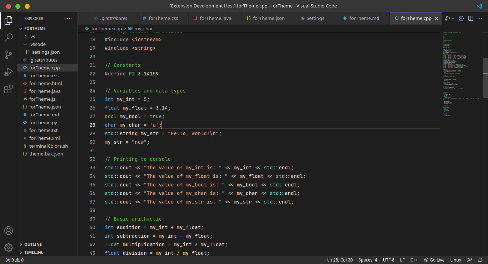

# Visual Studio 2022 Themes for VSCode

This extension provides themes inspired by Visual Studio 2022 for Visual Studio Code, including both light and dark themes. It also includes semantic highlighting.

### Visual Studio 2022 Blue

 

### Visual Studio 2022 Dark

 

## References
- https://code.visualstudio.com/api/language-extensions/semantic-highlight-guide

## Legal Notice
- This repository is not affiliated with Microsoft Corporation.
- Visual Studio and Visual Studio Code are trademarks of Microsoft Corporation.